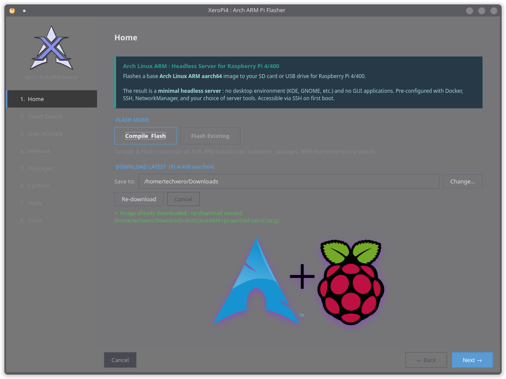

<div align="center">
  
  <h1>XeroPi4</h1>
  <p><strong>Arch Linux ARM flasher for Raspberry Pi 4 / 400</strong></p>
  <p>
    
    
    
    
  </p>
</div>

---



---

## What is it?

XeroPi4 is a graphical wizard that takes an official Arch Linux ARM tarball and flashes it to an SD card, USB drive, or NVMe enclosure, with your configuration baked in before the Pi ever boots.

No post-boot tinkering. Plug in, power on, done.

---

## Features

- **Personal mode** : bake in username, password, hostname, SSH key, WiFi credentials, static IP (WiFi + Ethernet), and packages
- **Distribution mode** : build a clean image with a first-boot setup wizard for end users
- **First-boot package installer** : installs selected packages via pacman on first boot, self-removes after completion
- **Flash verification** : confirms BOOT and ROOT partition labels after writing
- **Quiet boot** : suppresses kernel console spam on HDMI for a clean login prompt
- **Pi 4 tuned** : correct keyring, pacman tweaks, mkinitcpio hooks, U-Boot boot args
- **Ethernet + WiFi static IP** : independent static profiles for each interface via NetworkManager
- **Curated package list** : 50+ server, homelab, security, and utility packages organised by category

---

## Requirements

- Arch Linux host (pacman required)
- `python` `python-pyside6` `libarchive` `uboot-tools` `polkit`
- Official Arch Linux ARM tarball for RPi 4: [archlinuxarm.org](https://archlinuxarm.org/platforms/armv8/broadcom/raspberry-pi-4)

---

## Run

```bash
curl -fsSL https://raw.githubusercontent.com/xerolinux/XeroArchArm/main/run.sh | bash
```

Downloads the latest version, installs the polkit policy, and launches the tool. Re-running the command updates to the latest version automatically.

For distribution mode:

```bash
curl -fsSL https://raw.githubusercontent.com/xerolinux/XeroArchArm/main/run.sh | bash -s -- --dist
```

---

## How it works

1. Select your Arch Linux ARM tarball
2. Select your target device (SD card, USB, NVMe)
3. Configure user account, network, and packages
4. Hit Flash and the tool writes, configures, and verifies the image
5. On first boot the Pi installs selected packages, then reboots into a clean system

---

## Package categories

| Category | Examples |
|---|---|
| Server Core | openssh, networkmanager, docker, fail2ban, sudo |
| Monitoring | btop, glances, smartmontools, iotop, nethogs |
| Network Tools | nmap, tcpdump, mtr, bind-tools, iperf3 |
| VPN & Tunneling | tailscale, wireguard-tools, openvpn |
| File Sharing | samba, nfs-utils, rclone |
| Security | ufw, lynis, rkhunter, aide, nftables |
| Web & Proxy | nginx, caddy, haproxy |
| Databases | mariadb, postgresql, redis, sqlite |
| Homelab | mosquitto, grafana, prometheus, node_exporter |
| Utilities | fzf, bat, ripgrep, jq, fd |

---

## License

GPL v3 - see [LICENSE](LICENSE)

---

<div align="center">
  <sub>Built for <a href="https://xerolinux.xyz">XeroLinux</a></sub>
</div>
